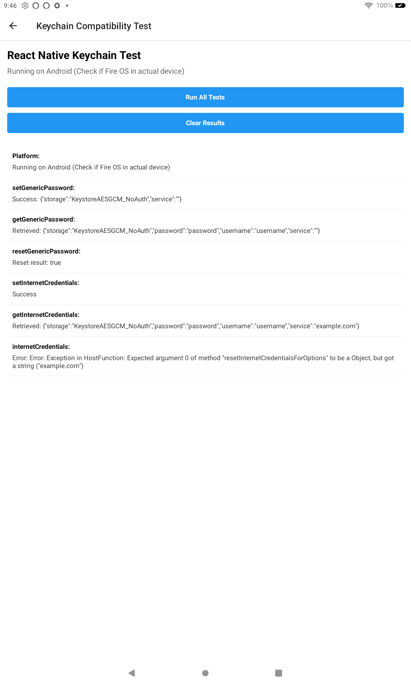

# Keychain Test App for Fire OS

This is an [Expo](https://expo.dev) project created to test the compatibility of [react-native-keychain](https://github.com/oblador/react-native-keychain) with Fire OS devices.

## Screenshot



## Features

- Integration with react-native-keychain
- Test interface for keychain operations
- Compatibility testing for Fire OS

## Get started

1. Install dependencies

   ```bash
   npm install
   ```

2. Start the app

   ```bash
   npx expo start
   ```

3. To test on a Fire OS device:
   - Create a development build
   ```bash
   npx expo prebuild
   npx expo build:android
   ```
   - Install the APK on your Fire OS device
   - Run the tests from the app interface

## Testing on Fire OS

To properly test on Fire OS:

1. Build the app for Android
2. Install on a Fire OS device (Fire tablet or Fire TV)
3. Run the keychain tests from the main screen
4. Check the results to verify compatibility

## Implementation Details

The app tests the following keychain operations:
- Setting generic passwords
- Getting generic passwords
- Resetting generic passwords
- Setting/getting/resetting internet credentials

## Learn more

- [Expo documentation](https://docs.expo.dev/)
- [react-native-keychain documentation](https://github.com/oblador/react-native-keychain)
- [Fire OS developer documentation](https://developer.amazon.com/docs/fire-tablets/ft-dev-overview.html)
